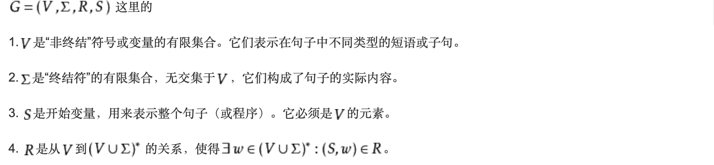
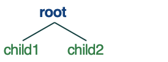

# ToyParser

## Why this project?

为什么想要实现词法分析器呢？

- 本科的时候编译原理才考了78分，当时词法分析就掌握的不好
- 现在研一在上NLP，里面再次涉及到了词法分析
- 自己实现一遍基础算法，可以提高代码能力、加深理解、**“充实”业余生活**

## What is this project?

这个小项目最后希望达到什么预期呢？我目前的想法是这样的：（或许会有改变

- 用户给定CFG文法，可以在txt中给出
- 用户输入句子
- 判断句子是否合法？是的话绘制生成树

感觉好简单的样子。。。

## How to do?

初步的想法是分成~~两~~三个部分

- CFG的读入与表示
- parser-tree的结构表示
- parser算法的实现

### CFG读入与表示



[参考](https://baike.baidu.com/item/上下文无关文法)

CFG主要包括上面介绍的4个部分，因此设想是在一个文件夹中用3个文件分别进行表示

- ntrms.txt
  - 第一个为开始变量，每一行表示一个非终结符
- trms.txt
  - 与ntrms.txt类似
- relations.txt
  - 每一行表示一条规则，以`|-`进行分割

- [x] CFG的读入与表示（20200412）

### tree的表示

- 采用`node(word, list(node))`这种结构来存储tree

- 通过遍历tree来生成一个类似下面的list，然后利用nltk绘制tree

  ```python
  demo_list = [('root', 0), ('child1', 1), ('child2', 1)] 
  def draw():
    par_result = ''
  		for node in demo_list:
        par_result += "\t" + node[0] + "\t" + 'null' + "\t" + str(node[1]) + "\n"
        conlltree = DependencyGraph(par_result)  
        tree = conlltree.tree()  # 构建树结构
        tree.draw()  # 显示输出的树
  ```

  效果如下：

  